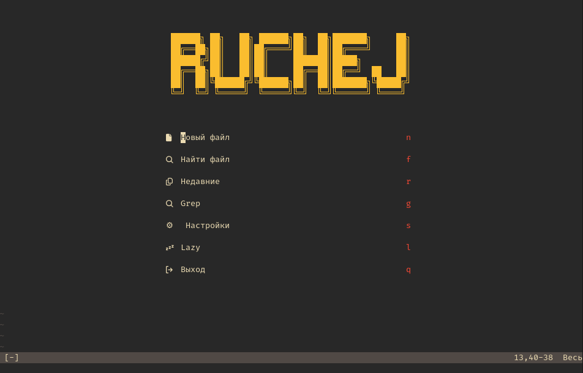

# RuchejNvim

Минималистичная конфигурация Neovim для Python-разработки с поддержкой Vue.js, TypeScript, JavaScript и других языков.

> **Последнее обновление:** Февраль 2026
> **Neovim:** ≥ 0.11

## 📋 Скриншот



## 📋 Требования

### Обязательные

| Приложение | Версия | Для чего | Как проверить |
|------------|--------|----------|---------------|
| **Neovim** | ≥ 0.11 | Основа | `nvim --version` |
| **Python 3** | ≥ 3.8 | Python LSP, DAP | `python3 --version` |
| **git** | любая | Установка плагинов | `git --version` |
| **Node.js** | ≥ 18 | TypeScript, Vue LSP | `node --version` |
| **npm** | ≥ 9 | Установка prettier, TS | `npm --version` |

### Рекомендуемые (для форматирования)

| Приложение | Версия | Для чего | Как установить |
|------------|--------|----------|----------------|
| **ruff** | ≥ 0.5 | Python форматирование | `pip install ruff` |
| **prettier** | ≥ 3 | JS/TS/Vue/CSS форматирование | `npm install -g prettier` |
| **jq** | любая | JSON форматирование | `pacman -S jq` или `apt install jq` |
| **stylua** | любая | Lua форматирование | `cargo install stylua` |

### Для отладки Python

| Приложение | Версия | Для чего | Как установить |
|------------|--------|----------|----------------|
| **debugpy** | ≥ 1.8 | Python debugger | `pip install debugpy` |

### LSP серверы (устанавливаются через Mason)

| Сервер | Язык | Команда |
|--------|------|---------|
| **pyright** | Python | `:Mason` → Install |
| **ruff** | Python | `:Mason` → Install |
| **lua_ls** | Lua | `:Mason` → Install |
| **ts_ls** | TypeScript | `:Mason` → Install |
| **vue_ls** | Vue.js | `:Mason` → Install |
| **jsonls** | JSON | `:Mason` → Install |
| **bashls** | Bash | `:Mason` → Install |
| **marksman** | Markdown | `:Mason` → Install |

---

## 🚀 Быстрый старт

### 1. Установка зависимостей

```bash
# Arch Linux
sudo pacman -S neovim python python-pip nodejs npm git jq

# Python утилиты
pip install ruff debugpy

# Prettier для JS/TS/Vue
npm install -g prettier
```

### 2. Запуск

```bash
nvim
```

При первом запуске lazy.nvim автоматически установит плагины.

### 3. Установка LSP серверов

```vim
:Mason
```

Выбери и установи (нажми `I`):
- `pyright`
- `ruff`
- `lua_ls`
- `ts_ls`
- `vue_ls`
- `jsonls`
- `bashls`
- `marksman`

---

## 📁 Структура

```
~/.config/RuchejNvim/
├── init.lua                    # Точка входа
├── README.md                   # Документация
├── .prettierrc                 # Глобальные настройки prettier
├── stylua.toml                 # Настройки stylua
├── ruff.toml                   # Настройки ruff
└── lua/
    ├── core/
    │   ├── options.lua         # Базовые настройки Neovim
    │   ├── keymaps.lua         # Горячие клавиши
    │   ├── autocommands.lua    # Автокоманды
    │   └── functions.lua       # Вспомогательные функции
    ├── plugins/
    │   ├── init.lua            # lazy.nvim и плагины
    │   ├── cmp.lua             # Автодополнение
    │   ├── dap.lua             # Отладчик Python
    │   ├── gitsigns.lua        # Git интеграция
    │   ├── neo-tree.lua        # Файловый менеджер
    │   └── indent-blankline.lua # Indent guides
    └── lsp/
        └── init.lua            # LSP конфигурация
```

---

## ⌨️ Горячие клавиши

> **Совет:** Нажми `<leader>` и подожди секунду — [which-key](https://github.com/folke/which-key.nvim) покажет все доступные комбинации!

### Общие
| Клавиши | Описание |
|---------|----------|
| `<leader><space>` | Очистить подсветку поиска |
| `jk` (в insert mode) | Выйти из режима вставки |
| `<leader>z` | Свернуть/развернуть блок (folding) |

### Dashboard
При запуске Neovim без файлов открывается dashboard с заголовком RUCHEJ и меню:

| Клавиша | Описание |
|---------|----------|
| `n` | Новый файл |
| `f` | Найти файл |
| `r` | Недавние файлы |
| `g` | Поиск по тексту (grep) |
| `s` | Настройки (открыть конфиг) |
| `l` | Lazy (менеджер плагинов) |
| `q` | Выход |

### Буферы
| Клавиши | Описание |
|---------|----------|
| `<leader>bn` | Следующий буфер |
| `<leader>bp` | Предыдущий буфер |
| `<leader>bd` | Закрыть буфер (через Bclose) |

### Навигация
| Клавиши | Описание |
|---------|----------|
| `<C-n>` | Открыть/закрыть Neo-tree |
| `<leader>n` | Показать текущий файл в Neo-tree |
| `<leader>mp` | Открыть/закрыть Markdown preview |
| `gD` | Перейти к объявлению |
| `gd` | Перейти к определению |
| `gi` | Перейти к реализации |
| `gr` | Найти ссылки |
| `K` | Показать документацию |
| `<C-k>` | Показать сигнатуру функции |

### LSP действия
| Клавиши | Описание |
|---------|----------|
| `<leader>e` | Показать диагностику |
| `]d` / `[d` | Следующая / предыдущая ошибка |
| `<leader>q` | Добавить ошибки в loclist |
| `<leader>rn` | Переименовать символ |
| `<leader>ca` | Действие с кодом |
| `<leader>f` | Форматировать файл |
| `<leader>rf` | Форматировать Python (ruff) |
| `<leader>D` | Перейти к определению типа |

### Поиск (FZF Lua)
| Клавиши | Описание |
|---------|----------|
| `<leader>ff` | Найти файл |
| `<leader>fg` | Поиск по тексту (grep) |
| `<leader>fb` | Буферы |
| `<leader>fh` | Справка |
| `<leader>fm` | Горячие клавиши |
| `<leader>fo` | Недавние файлы |
| `<leader>fc` | Команды |

### Отладка Python (DAP)
| Клавиши | Описание |
|---------|----------|
| `<leader>b` | Точка останова |
| `<F9>` | Запустить/продолжить |
| `<F8>` | Шаг с обходом |
| `<F7>` | Шаг с заходом |
| `<leader>dr` | Открыть REPL |
| `<leader>di` | Показать переменную |
| `<leader>dui` | Открыть/закрыть DAP UI |

### Git (gitsigns)
| Клавиши | Описание |
|---------|----------|
| `<leader>hn` | Следующее изменение |
| `<leader>hp` | Предыдущее изменение |
| `<leader>hv` | Показать изменение |
| `<leader>td` | Показать inline diff |
| `<leader>gb` | Git blame |

### LazyGit
| Клавиши | Описание |
|---------|----------|
| `<leader>gg` | Открыть LazyGit |
| `<leader>gf` | LazyGit фильтр |
| `<leader>gc` | LazyGit текущий файл |

---

## 🎨 Форматирование

| Тип файла | Форматтер | Команда |
|-----------|-----------|---------|
| **Python** | ruff | `<space>f` |
| **TypeScript** | ts_ls (LSP) | `<space>f` |
| **JavaScript** | prettier | `<space>f` |
| **Vue** | vue_ls + ts_ls | `<space>f` |
| **JSON** | jq | `<space>f` |
| **Lua** | stylua или LSP | `<space>f` |
| **CSS/SCSS/HTML** | prettier | `<space>f` |
| **YAML/Markdown** | prettier | `<space>f` |

**Примечание:** Prettier автоматически находит конфиг проекта (`.prettierrc`) в директории файла.

---

## 🔌 Плагины

| Плагин | Описание |
|--------|----------|
| **lazy.nvim** | Менеджер плагинов |
| **alpha-nvim** | Dashboard (стартовый экран) |
| **nvim-lspconfig** | Конфигурация LSP |
| **mason.nvim** | Установка LSP серверов |
| **mason-lspconfig.nvim** | Интеграция Mason + LSP |
| **neo-tree.nvim** | Файловый менеджер |
| **gitsigns.nvim** | Git интеграция |
| **nvim-cmp** | Автодополнение |
| **nvim-treesitter** | Подсветка синтаксиса |
| **nvim-dap** | Отладчик (Python) |
| **nvim-dap-ui** | UI для отладчика |
| **fzf-lua** | Fuzzy finder |
| **gruvbox** | Цветовая схема |
| **bclose.vim** | Закрытие буферов |
| **markdown-preview.nvim** | Preview Markdown файлов |
| **nvim-surround** | Операции surround (кавычки, скобки) |
| **vim-easymotion** | Быстрая навигация по тексту |
| **indent-blankline.nvim** | Направляющие отступов |
| **rainbow_csv** | Подсветка CSV колонок |
| **lazygit.nvim** | Git TUI (требуется `lazygit`) |
| **which-key.nvim** | Popup с доступными клавишами |

---

## ⚙️ Настройка

### Which-Key (шпаргалка по клавишам)

Плагин **which-key.nvim** автоматически показывает доступные клавиши:

1. Нажми `<leader>` и подожди ~500мс
2. Увидишь popup со всеми доступными комбинациями
3. Нажми следующую клавишу для выполнения команды

**Пример:**
```
<leader> → показывает: b=buffer, f=format, g=git, ...
<leader>g → показывает: gg=LazyGit, gb=blame, hn=next hunk, ...
```

### LazyGit

Для работы **lazygit.nvim** требуется установить `lazygit`:

```bash
# Arch Linux
sudo pacman -S lazygit

# Или через go
go install github.com/jesseduffield/lazygit@latest
```

### Свой конфиг проекта

Создай `.prettierrc` в корне проекта:

```json
{
  "tabWidth": 4,
  "semi": true,
  "singleQuote": true,
  "printWidth": 120
}
```

Prettier автоматически применит эти настройки при форматировании.

### Отключить плагины

В `lua/plugins/init.lua` добавь `enabled = false`:

```lua
{
  'some/plugin',
  enabled = false,
}
```

---

## 🐛 Отладка проблем

### Плагины не устанавливаются

```vim
:Lazy sync
```

### LSP не работает

```vim
:Mason
:LspInfo
:LspLog
```

### Форматирование не работает

Проверь, что утилита установлена:

```bash
which prettier
which ruff
which jq
```

---

## 📚 Полезные команды

```vim
:Lazy              " Менеджер плагинов
:Mason             " Менеджер LSP серверов
:LspInfo           " Информация о LSP
:checkhealth       " Проверка конфигурации
:messages          " История сообщений
```

---

## 🔗 Ссылки

- [Neovim документация](https://neovim.io/doc/)
- [lazy.nvim](https://github.com/folke/lazy.nvim)
- [nvim-lspconfig](https://github.com/neovim/nvim-lspconfig)
- [Mason](https://github.com/williamboman/mason.nvim)
